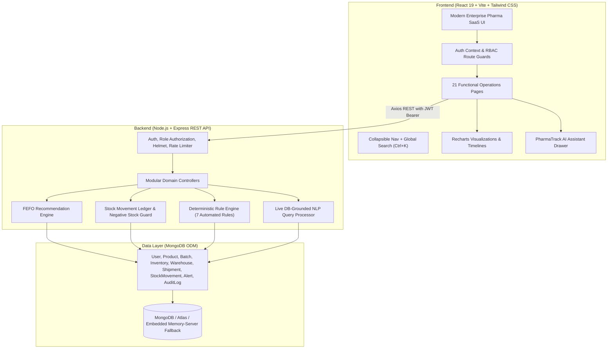

# PharmaTrack
> **Pharmaceutical Supply Chain & Inventory Management Platform**  
> *"Smarter Pharmaceutical Supply Chains"*

[](https://nodejs.org)
[](https://react.dev)
[](https://expressjs.com)
[](https://mongoosejs.com)
[](https://tailwindcss.com)

---

## 1. Project Overview

**PharmaTrack** is an enterprise-grade pharmaceutical operations and digital supply chain management platform designed for pharmaceutical manufacturers, central distributors, and hospital health systems. 

Unlike generic CRUD inventory templates, PharmaTrack implements **deterministic pharmaceutical business logic**:
- **FEFO (First Expiry, First Out)** allocation to prioritize batches with earliest shelf-life and mitigate write-offs.
- **Stock Reservation Lifecycle** preventing double-allocation of stock between requisition booking and dock departure.
- **Automated Cold-Chain & Expiry Risk Rules** automatically quarantining expired batches and flagging delayed shipments.
- **Capacity Load Optimization** tracking cubic unit limits and utilization alerts across regional distribution hubs.
- **Grounded Operational AI Assistant** providing natural language query capabilities directly over live database records without hallucination or medical diagnosis.

---

## 2. System Architecture



---

## 3. Technology Stack

### Frontend
- **React.js (v19)** with **Vite** for rapid HMR and optimized production bundles.
- **Tailwind CSS** for enterprise clinical data density and color-coded status badges.
- **React Router (v7)** for declarative role-guarded routing.
- **Recharts** for interactive capacity, movement velocity, and category distribution charts.
- **Lucide React** for consistent healthcare and logistics iconography.
- **Axios** with automatic JWT interceptors and session recovery.

### Backend
- **Node.js** & **Express.js** REST API.
- **MongoDB** & **Mongoose ODM** with indexes, virtuals, and composite keys.
- **JWT (JSON Web Tokens)** & **bcryptjs** for credential encryption and authentication.
- **Security Suite**: `helmet`, `cors`, and `express-rate-limit` against brute-force attacks.
- **Morgan** for HTTP audit logging.

### Dual-Mode Database Connector
- **Production Mode**: Seamlessly connects to any external `MONGODB_URI` (MongoDB Atlas or local daemon).
- **Zero-Setup Review Mode**: If no external MongoDB daemon is active, an embedded `mongodb-memory-server` is spawned transparently and auto-populated with demo data so evaluators can test immediately with one command.

---

## 4. Role-Based Access Control (RBAC)

| Feature / Domain | Administrator (`ADMIN`) | Inventory Manager (`INVENTORY_MANAGER`) | Warehouse Manager (`WAREHOUSE_MANAGER`) |
| :--- | :---: | :---: | :---: |
| **Operational Dashboard & KPIs** | Full | Full | Assigned Warehouse Hub |
| **Formulations Catalog** | Create, Read, Update, Delete | Create, Read, Update | Read Only |
| **Multi-Hub Inventory Ledger** | Full Access | Full Access | Assigned Hub Only |
| **Batches & FEFO Recommender** | Full Access | Full Access | Assigned Hub Only |
| **Warehouses & Capacity** | Create, Update, Manage | Read Only | Update Assigned Facility |
| **Consignments & Shipments** | Create, Update, Cancel | Create, Update, Cancel | Update Status (Dispatch/Deliver) |
| **Operational Alerts** | View & Resolve All | View & Resolve Inventory | View Assigned Alerts |
| **Regulatory Audit Trail** | Full Access | Restricted | Restricted |
| **User Access Governance** | Full Access | Restricted | Restricted |

---

## 5. Demo Accounts

For interview demonstration, click the **"One-Click Demo Role Accounts"** buttons on the Login page or use:

| Role | Email | Password | Scope |
| :--- | :--- | :--- | :--- |
| **Administrator** | `admin@pharmatrack.com` | `Admin@123` | Full governance, users & audit logs |
| **Inventory Manager** | `inventory@pharmatrack.com` | `Inventory@123` | Formulations, stock movements, FEFO |
| **Warehouse Manager** | `warehouse@pharmatrack.com` | `Warehouse@123` | Mumbai Hub dock operations |

---

## 6. End-to-End Business Workflows

```
Product Registration ──► Batch Manufacturing ──► Inbound Stock Ledger
                                                         │
                                                         ▼
Delivered Consignment ◄── Dispatched ◄── Reserved ◄── FEFO Allocation
         │                    │
         ▼                    ▼
   Actual SLA Log     Outbound Movement ──► Regulatory Audit Trail ──► Automated Alerts
```

1. **FEFO Prioritization**: When creating consignments or fulfilling orders, the system automatically checks batches sorted ascending by `expiryDate` (`expiryDate > now`), highlighting the optimal lot.
2. **Expired Lot Protection**: Expired batches are blocked from inclusion in shipments or outbound transfers with strict server-side validation.
3. **Stock Reservation**: Booking a consignment moves units to `reservedQuantity`. Stock cannot be double-allocated.
4. **Dock Dispatch Execution**: Transitioning status to `DISPATCHED` deducts inventory and registers an immutable `OUTBOUND` stock movement.
5. **Deterministic Alerts**: The engine automatically detects low stock thresholds, out-of-stock items, batches expiring within 30 or 90 days, warehouse capacity loads $\ge 90\%$, and delayed consignments.

---

## 7. REST API Reference

### Authentication
- `POST /api/auth/login` - Authenticate credentials and issue JWT.
- `GET /api/auth/me` - Retrieve current authenticated user profile.

### Formulations (Products)
- `GET /api/products` - Search, filter, and paginate formulations with live stock calculations.
- `GET /api/products/:id` - Product specifications, warehouse breakdown, and linked batches.
- `POST /api/products` - Register a new formulation (`ADMIN`, `INVENTORY_MANAGER`).
- `PUT /api/products/:id` - Update formulation details.
- `DELETE /api/products/:id` - Delete or soft-retire formulation (`ADMIN`).

### Inventory & Movements
- `GET /api/inventory` - Multi-warehouse stock ledger (Gross, Reserved, Available).
- `POST /api/inventory/movement` - Record `INBOUND`, `OUTBOUND`, `TRANSFER`, or `ADJUSTMENT`.
- `GET /api/inventory/movements` - Query immutable stock movement ledger.

### Batches & FEFO
- `GET /api/batches` - Query batches with computed `daysUntilExpiry` and `expiryStatus`.
- `GET /api/batches/fefo-recommendations/:productId` - Optimal FEFO lot picking order.
- `POST /api/batches` - Register batch and initialize warehouse inventory.
- `PUT /api/batches/:id` - Update lot status (`RELEASED`, `QUARANTINE`, `RECALLED`).

### Warehouses & Capacity
- `GET /api/warehouses` - Regional hubs with capacity utilization percentages.
- `GET /api/warehouses/:id` - Hub stored products, movements, and consignments.
- `POST /api/warehouses` - Provision new regional facility (`ADMIN`).

### Consignments & Logistics
- `GET /api/shipments` - Filter consignments by status (`PENDING`, `DISPATCHED`, `IN_TRANSIT`, `DELIVERED`, `DELAYED`).
- `POST /api/shipments` - Book consignment, validate batch shelf-life, and reserve stock.
- `PATCH /api/shipments/:id/status` - Transition status and trigger stock deduction.

### Operational Intelligence
- `GET /api/alerts` - Operational alerts by severity and resolution status.
- `PATCH /api/alerts/:id/resolve` - Resolve and log corrective audit action.
- `GET /api/analytics/dashboard` - Live calculated KPIs and 5 chart datasets.
- `GET /api/analytics/reports` - Valuation, top velocity formulations, and carrier fulfillment rates.
- `POST /api/ai/query` - Grounded operational assistant query handler.

---

## 8. How to Run Locally

### Prerequisites
- **Node.js**: v18.0.0 or higher
- **npm**: v9.0.0 or higher

### Quick Start

1. **Clone the repository:**
   ```bash
   git clone <repo-url>
   cd PharmaTrack
   ```

2. **Install all dependencies:**
   ```bash
   npm run install:all
   ```

3. **Configure Environment Variables:**
   - Both `server/.env` and `client/.env` come pre-configured.
   - If you have a local or cloud MongoDB instance, set `MONGODB_URI` in `server/.env`.
   - If left as default, the embedded in-memory database will automatically take over for demo mode.

4. **Seed the Database with Demo Pharma Data:**
   ```bash
   npm run seed
   ```

5. **Start Both Applications:**
   - Backend API: `cd server && npm start` (Runs on `http://localhost:5000`)
   - Frontend: `cd client && npm run dev` (Runs on `http://localhost:5173`)

6. **Open the Operations Console:**
   Navigate to `http://localhost:5173` and log in with any of the demo accounts!

---

## 9. Grounded AI Assistant Examples

Click the **AI Assistant** button in the navbar or sidebar to test natural language operational queries:

- *"Which products are currently low on stock?"*  
  → Accurately identifies formulations operating below minimum safety levels with remaining units.
- *"Which batches expire within 30 days?"*  
  → Highlights critical shelf-life batches and flags any expired lots for quarantine.
- *"Which warehouse has the highest utilization?"*  
  → Reports storage loads against facility capacity.
- *"Are there any delayed shipments?"*  
  → Scans consignments exceeding planned delivery dates.

*Notice: The AI Assistant is grounded in the live MongoDB operations data and provides operational supply-chain intelligence, not clinical medical advice.*

---

## 10. License & Attribution

This project is built independently as a portfolio demonstration for Digital Product & Technology roles in healthcare and pharmaceutical supply chain operations. It uses fictional generic formulations and synthetic operational data only.